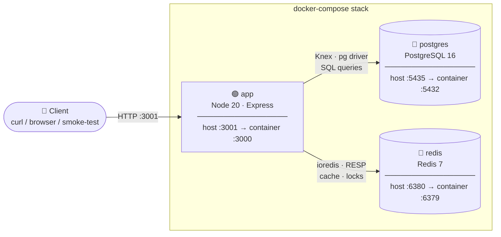
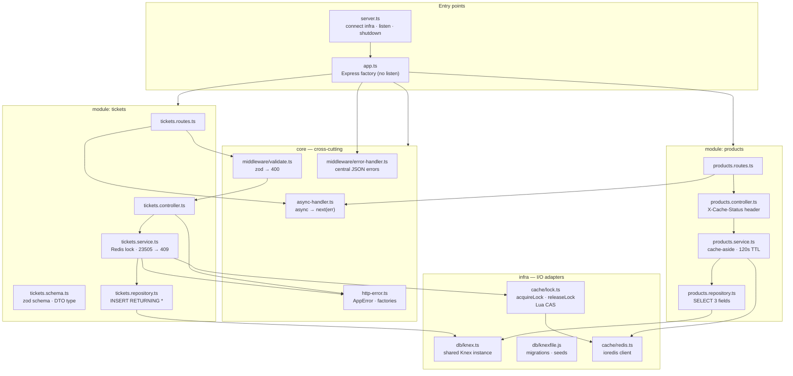
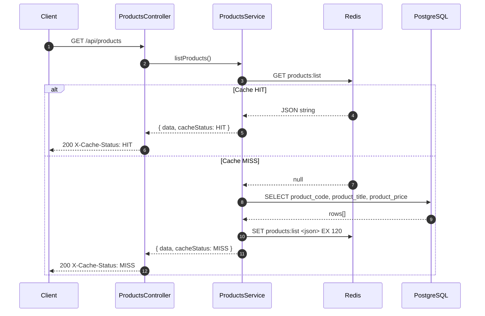
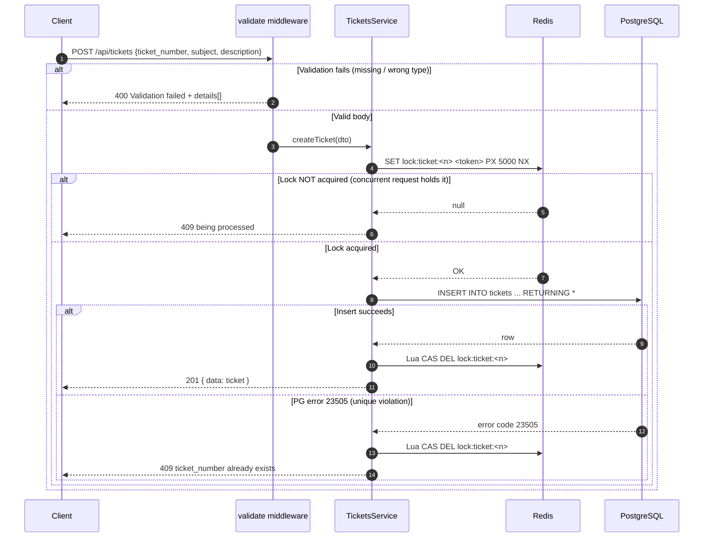
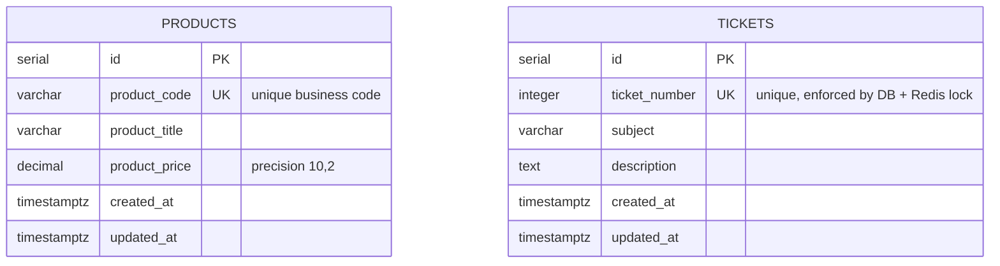
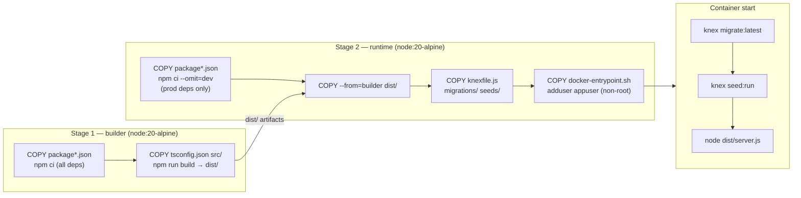

# salesfin-task

**Express + TypeScript + Knex + PostgreSQL + Redis**

Backend challenge: product list with Redis caching and ticket submission with distributed locking.

---

## Quick start (Docker Compose — recommended)

```bash
# Build and start all services (postgres, redis, app)
docker compose up --build -d

# Wait ~10s for services to become healthy, then run smoke tests
./scripts/smoke-test.sh

# Tear down (including postgres volume)
docker compose down -v
```

The app auto-runs `knex migrate:latest` + `knex seed:run` on startup, so products are seeded immediately.

---

## Architecture

### Component architecture

How the three Docker services connect to each other and to the outside world.



---

### Code architecture (modular monolith)

The application is split into three horizontal layers that sit inside two vertical slices (modules). No module reaches into another module's internals — they share only `core` and `infra`.



---

### Request flow — GET /api/products (cache-aside)



---

### Request flow — POST /api/tickets (distributed lock)



---

### Entity relationship diagram



> The two tables share the same database (`salesfin`) but have no foreign-key relationship; they are independent domain entities.

---

### Docker image build (multi-stage)



---

## API

### `GET /api/products`

Lists all products. Response is cached in Redis for **120 seconds**.

**Response**

```json
{
  "data": [
    { "product_code": "PROD-001", "product_title": "Wireless Keyboard", "product_price": "49.99" }
  ]
}
```

**Headers**

| Header | Value | Meaning |
|--------|-------|---------|
| `X-Cache-Status` | `MISS` | Response fetched from the database |
| `X-Cache-Status` | `HIT`  | Response served from Redis cache   |

**Curl examples**

```bash
# First call → MISS
curl -i http://localhost:3001/api/products

# Second call (within 2 min) → HIT
curl -i http://localhost:3001/api/products
```

---

### `POST /api/tickets`

Submits a support ticket. All fields are **mandatory**.

| Field | Type | Constraints |
|-------|------|-------------|
| `ticket_number` | integer | required, unique |
| `subject` | string | required, non-empty |
| `description` | text | required, non-empty |

**Concurrency / locking**

Before inserting, the service acquires a **Redis distributed lock** (SET NX PX)
keyed on `ticket_number`. This prevents duplicate-processing under concurrent
requests when the app runs horizontally. A **Lua compare-and-delete** releases
the lock — so we never accidentally drop another holder's lock if ours expired
mid-flight. The database `UNIQUE` constraint on `ticket_number` is the
authoritative backstop even if the lock expires.

**Responses**

| Status | Condition |
|--------|-----------|
| 201 | Ticket created successfully |
| 400 | Missing / invalid field(s) — response includes `details[]` |
| 409 | `ticket_number` already exists (or is being concurrently processed) |

**Curl examples**

```bash
# Create a ticket
curl -i -X POST http://localhost:3001/api/tickets \
  -H 'Content-Type: application/json' \
  -d '{"ticket_number":1,"subject":"Login bug","description":"Cannot log in after deploy"}'
# → 201

# Duplicate
curl -i -X POST http://localhost:3001/api/tickets \
  -H 'Content-Type: application/json' \
  -d '{"ticket_number":1,"subject":"Login bug","description":"Cannot log in after deploy"}'
# → 409

# Missing field
curl -i -X POST http://localhost:3001/api/tickets \
  -H 'Content-Type: application/json' \
  -d '{"ticket_number":2}'
# → 400 { "error": "Validation failed", "details": [...] }
```

---

## Local development (without Docker)

```bash
npm install

# Start local postgres and redis (Docker)
docker run -d --name pg -e POSTGRES_DB=salesfin -e POSTGRES_USER=salesfin \
  -e POSTGRES_PASSWORD=salesfin -p 5432:5432 postgres:16-alpine
docker run -d --name redis -p 6379:6379 redis:7-alpine

# Copy and edit env
cp .env.example .env

# Migrate + seed
npm run migrate
npm run seed

# Dev server (hot-reload)
npm run dev
```

---

## Tests

### 1. Jest feature tests

Unit-style integration tests using supertest against a real PostgreSQL + Redis instance.

```bash
# Start infra
docker compose up -d postgres redis

# Run all suites
npm test
```

| Suite | Tests | What is verified |
|-------|-------|-----------------|
| `products.test.ts` | 4 | 200 response · correct fields · cache MISS→HIT · Redis TTL |
| `tickets.test.ts` | 9 | 201 success · 409 duplicate · 400 missing / null / empty fields · concurrency (two simultaneous POSTs → exactly one 201 + one 409) |

The concurrency test inside Jest fires two `Promise.all` requests within the same Node process — it validates the lock logic but does not simulate separate OS-level connections.

---

### 2. Smoke test

End-to-end curl checks against the running Docker stack.

```bash
docker compose up --build -d
./scripts/smoke-test.sh          # or: npm run smoke
```

| # | Check | Expected |
|---|-------|----------|
| 1 | `GET /health` | 200 |
| 2 | `GET /api/products` (1st call) | 200 · `X-Cache-Status: MISS` |
| 3 | `GET /api/products` (2nd call) | 200 · `X-Cache-Status: HIT` |
| 4 | `POST /api/tickets` valid body | 201 |
| 5 | `POST /api/tickets` duplicate `ticket_number` | 409 |
| 6 | `POST /api/tickets` missing field | 400 |

---

### 3. Concurrency test — shell (parallel curl)

Fires N real OS processes simultaneously, all posting the same `ticket_number`.

```bash
./scripts/concurrency-test.sh [BASE_URL] [CONCURRENCY]

# Examples
./scripts/concurrency-test.sh                        # 10 parallel requests → localhost:3001
./scripts/concurrency-test.sh http://localhost:3001 50   # 50 parallel requests
npm run concurrency
```

**Expected output**

```
═══════════════════════════════════════════════════════
  Concurrency Test — POST http://localhost:3001/api/tickets
  ticket_number : 63100
  parallel reqs : 10
═══════════════════════════════════════════════════════

  Results per request:
    request 1  → 409
    request 2  → 409
    request 3  → 201   ← only one winner
    request 4  → 409
    ...

  Summary:
    201 Created  : 1   (expected: 1)
    409 Conflict : 9   (expected: 9)

  ✓ PASS — lock held correctly, exactly one ticket created
═══════════════════════════════════════════════════════
```

---

### 4. Concurrency test — Apache Benchmark (`ab`)

`ab` opens all connections simultaneously from a single process, giving true HTTP-level parallelism with detailed latency statistics.

**Install**

```bash
brew install httpd          # macOS
apt install apache2-utils   # Debian / Ubuntu
```

**Run**

```bash
./scripts/concurrency-ab.sh [BASE_URL] [TOTAL] [CONCURRENCY]

# Examples
./scripts/concurrency-ab.sh                             # 20 req, 20 concurrent → localhost:3001
./scripts/concurrency-ab.sh http://localhost:3001 50 50  # 50 req, all concurrent
npm run concurrency:ab
```

**Key `ab` flags used**

| Flag | Value | Purpose |
|------|-------|---------|
| `-n` | `TOTAL` | Total number of requests |
| `-c` | `CONCURRENCY` | Number of simultaneous connections |
| `-p` | `body.json` | File containing the JSON POST body (ab requires a file, not an inline string) |
| `-T` | `application/json` | `Content-Type` header |

> **Note on ab's "Failed requests" field:** ab labels any response whose status code or body size differs from the first response as "failed." When the first request returns `201` and all others return `409`, ab counts those 19 × 409s as "failed" — even though that is the correct, expected behaviour. The script ignores this field entirely and derives results purely from `Complete requests` and `Non-2xx responses`.

**Expected output**

```
═══════════════════════════════════════════════════════════════
  Apache Benchmark — Distributed Lock Concurrency Test
  endpoint      : POST http://localhost:3001/api/tickets
  ticket_number : 99621
  total reqs    : 20
  concurrency   : 20
═══════════════════════════════════════════════════════════════

Concurrency Level:      20
Time taken for tests:   0.045 seconds
Complete requests:      20
Failed requests:        19          ← ab counts 409s as "failed" — expected, see note above
Non-2xx responses:      19
Requests per second:    442.05 [#/sec] (mean)

Percentage of the requests served within a certain time (ms)
  50%     19
  99%     26

═══════════════════════════════════════════════════════════════
  Lock Invariant Check
───────────────────────────────────────────────────────────────
  Requests sent        : 20
  Complete             : 20
  Connection drops     : 0
  2xx — created (201)  : 1     expected: 1
  4xx — rejected (409) : 19    expected: 19
───────────────────────────────────────────────────────────────
  Throughput           : 442.05 req/s
  Latency p50 / p99    : 19 ms / 26 ms
───────────────────────────────────────────────────────────────
  ✓ PASS — lock held: exactly one ticket created, all others rejected
═══════════════════════════════════════════════════════════════
```

**Reading the results**

| Field | How it is derived | What it tells you |
|-------|------------------|------------------|
| `2xx — created (201)` | `Complete - Non-2xx` | Lock held — exactly one request won the race |
| `4xx — rejected (409)` | `Non-2xx responses` from ab | All others correctly rejected by the Redis lock or the DB constraint |
| `Connection drops` | `TOTAL - Complete` | Requests that got no HTTP response at all; non-zero means the server was overloaded |
| `Throughput` | `Requests per second` | End-to-end requests/s under maximum concurrency |
| `p50 / p99 latency` | ab percentile table | Covers both the fast lock-rejection path and the slower insert path |

**What a failure looks like**

| Symptom | Meaning |
|---------|---------|
| `2xx — created (201): > 1` | Lock is broken — duplicate tickets were written to the DB |
| `Connection drops: > 0` | Server crashed or was overloaded under the concurrency level |
| `4xx: 0` and `2xx: 20` | Lock is never acquired — all 20 inserts race directly to the DB |

---

### Test comparison

| Method | Parallelism | Latency stats | Lock + constraint coverage | Best for |
|--------|-------------|---------------|---------------------------|----------|
| Jest `Promise.all` | Event-loop concurrent | No | Lock path only | CI regression |
| Shell parallel curl | OS processes (true HTTP) | No | Lock + constraint | Quick manual check |
| Apache Benchmark | HTTP connections from one process | Yes (p50/p99) | Lock + constraint + throughput | Pre-merge load test |

---

## Project structure

```
src/
├── config/           # Typed env config
├── infra/
│   ├── db/           # Knex instance, knexfile, migrations, seeds
│   └── cache/        # Redis client, distributed lock (acquireLock/releaseLock)
├── core/             # AppError, validate middleware, error-handler, asyncHandler
├── modules/
│   ├── products/     # routes → controller → service (cache-aside) → repository
│   └── tickets/      # routes → controller → service (lock + insert) → repository
├── app.ts            # Express app factory (no listen — importable in tests)
├── routes.ts         # Mounts /health, /api/products, /api/tickets
└── server.ts         # Bootstrap: connect, listen, graceful shutdown
tests/                # Jest + supertest feature tests
scripts/              # smoke-test.sh
```

---

## Architecture decisions

- **Express + Knex** selected per the brief (NestJS mentions are leftover boilerplate).
- **Modular monolith**: each module owns its routes/controller/service/repository; no module reaches into another's internals.
- **Cache-aside on products**: Redis is checked first; DB query only on MISS; 120s TTL.
- **Redis lock on tickets**: `SET NX PX` prevents concurrent processing of the same `ticket_number`; Lua CAS release prevents lock theft; DB UNIQUE is the safety net.
- **Migrations as `.js`**: so `knex migrate:latest` works at container start without a TS build step.
- **Multi-stage Dockerfile**: builder compiles TS; runtime only installs prod deps and copies `dist/`.


## IDE & Tools 

- **Claude Code** for planning and implementations.
- **Cursor** for Debugging and find bugs.
- **Apache Benchmark** for testing concurrency about tickets creation.
- **Docker** for shipping the application.
